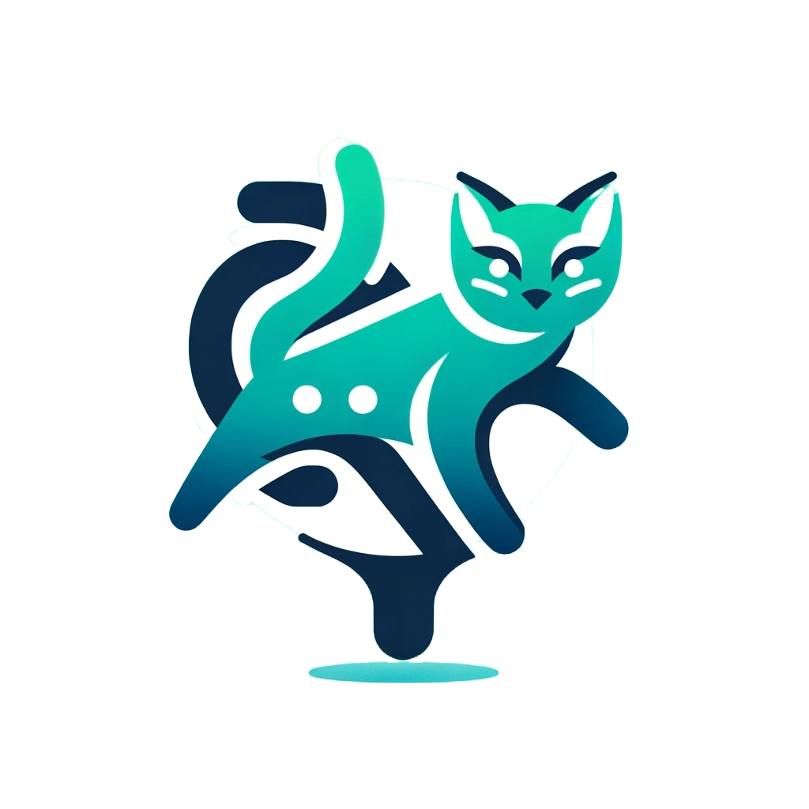

<p align="center"><a href="https://laravel.com" target="_blank"></a></p>

- Design & trace your survey results

## Installation

- Clone repository
- Run `php artisan sail:install` inside the project folder
- Select Postgres database, Redis & Memcached
- Run `sail up` inside the project folder
- Access the database using the following:
    - username: `sail`
    - password `password`
    - host `::1`
    - database: `surveycat`
- Add `alias sailbash='docker exec -it api-laravel.test-1 /bin/bash'` inside your `~/.bash_aliases`
- Run `source ~/.bash_aliases`
- Run `sailbash` for shell in dev container.
- Access `Telescope` dashboard in https://localhost/telescope
- Containers will start then can be inspected running using the `docker ps` command in the hosts bash
- To access the containers in Windows use the `Docker Desktop` executable or the `sailbash` command.

## Handling Telescope

- Run the following command to install Telescope:
    ```sh
    php artisan telescope:install
    ```

- Publish Telescope's migrations (only once during initial setup):
    ```sh
    php artisan vendor:publish --tag=telescope-migrations
    ```

- Whenever you run `php artisan migrate:refresh --seed`, also run:
    ```sh
    php artisan telescope:install
    ```

## Setting Up Sanctum

- Publish Sanctum's migrations (only once during initial setup):
    ```sh
    php artisan vendor:publish --tag=sanctum-migrations
    ```

- Update the `config/sanctum.php` file with the following changes:
    ```php
    'middleware' => [
        'authenticate_session' => Laravel\Sanctum\Http\Middleware\AuthenticateSession::class,
        'encrypt_cookies' => Illuminate\Cookie\Middleware\EncryptCookies::class,
        'validate_csrf_token' => Illuminate\Foundation\Http\Middleware\ValidateCsrfToken::class,
    ],
    ```

## License

The Surveycat app is licensed under the [MIT license](https://opensource.org/licenses/MIT).
